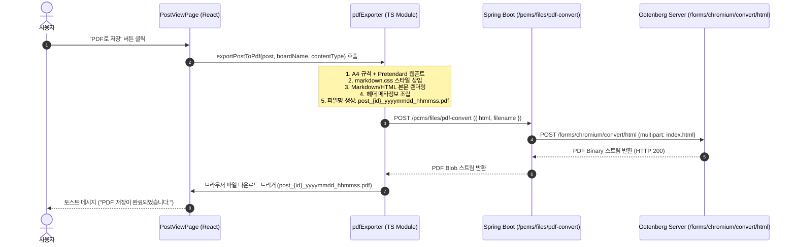

# 게시판관리 게시글 'PDF로 저장' 기능 설계 및 구현 명세

## 1. 개요 및 목적

게시판관리의 **게시글 보기(PostViewPage)** 화면에서 게시글의 내용을 PDF 문서로 변환하여 다운로드할 수 있는 **'PDF로 저장'** 기능을 구현한다.

- **지원 게시판 형식**: HTML 형식 및 Markdown 형식 게시판 모두 지원
- **PDF 변환 엔진**: 외부 **Gotenberg** 서버(`http://jskn.iptime.org/gotenberg`)의 Chromium 기반 HTML to PDF 변환 API 활용
- **목표**: 화면에 보이는 게시글 본문 및 메타정보(제목, 작성자, 일자 등)를 웹 뷰와 동일한 스타일(한글 폰트, 표, 코드블록, 아이콘 뱃지 등)로 정밀하게 PDF로 출력

---

## 2. Gotenberg 서버 정보 및 연동 방식

### 2.1 Gotenberg 서버 정보
- **기본 엔드포인트**: `http://jskn.iptime.org/gotenberg`
- **HTML to PDF 변환 URL**: `http://jskn.iptime.org/gotenberg/forms/chromium/convert/html`
- **전송 방식**: `multipart/form-data` POST 요청

### 2.2 Gotenberg 요청 파라미터 규격
| 파라미터명 | 타입 | 기본값 / 설정값 | 설명 |
|---|---|---|---|
| `files` | File | `index.html` (UTF-8) | 변환할 완성된 HTML 문서 |
| `preferCssPageSize` | Boolean | `true` | CSS `@page` 규칙(A4, 여백) 우선 적용 |
| `printBackground` | Boolean | `true` | 배경색, 블록 배경 및 그래픽 요소 인쇄 |
| `waitDelay` | String | `1s` | 웹폰트(Pretendard) 및 리소스 로드 대기 시간 |

### 2.3 Gotenberg CLI 호출 예시
```bash
curl --request POST 'http://jskn.iptime.org/gotenberg/forms/chromium/convert/html' \
  --form 'files=@post.html;filename=index.html' \
  --form 'preferCssPageSize=true' \
  --form 'printBackground=true' \
  --form 'waitDelay=1s' \
  -o post_123_20260901_112015.pdf
```

---

## 3. 전체 아키텍처 및 처리 흐름



### 아키텍처 설계 원칙
1. **백엔드 프록시 API 구축**:
   - 브라우저에서 직접 외부 Gotenberg 서버를 호출하지 않고 Spring Boot 백엔드(`/pcms/files/pdf-convert`)를 거치도록 설계
   - 브라우저 CORS 문제 및 HTTPS 환경에서의 Mixed Content 문제 원천 차단
   - Gotenberg 서버 주소를 백엔드 설정 파일(`application.properties`)에서 중앙 관리
   - 게시판뿐만 아니라 향후 다이어리, 일정, 장비관리 등 타 도메인에서도 재사용 가능

2. **프론트엔드 렌더링 일관성 보장**:
   - Markdown 렌더링은 프론트엔드의 `lib/markdownRenderer.ts`와 `styles/markdown.css`를 그대로 사용하여 웹 화면과 100% 동일한 출력 보장
   - HTML 게시글 또한 동일한 타이포그래피 및 인라인 스타일을 적용하여 정돈된 A4 문서 형태로 조립

---

## 4. 백엔드 구현 상세

### 4.1 설정 파일 (`application.properties` 등)
`gotenberg.url` 프로퍼티를 추가하고 환경별 오버라이드 지원.
- `backend/src/main/resources/application.properties`:
  ```properties
  # Gotenberg PDF 변환 서버 URL
  gotenberg.url=${GOTENBERG_URL:http://jskn.iptime.org/gotenberg}
  ```
- `backend/src/main/resources/application-development.properties`
- `backend/src/main/resources/application-jskn.properties`

### 4.2 PDF 서비스 계층 (`PdfService`, `PdfServiceImpl`)
- 위치: `kr.co.kalpa.pcms.domain.file.service`
- 주요 기능:
  - HTML 문자열을 `ByteArrayResource` (`index.html`)로 변환
  - `RestTemplate`을 통해 Gotenberg `/forms/chromium/convert/html`에 `multipart/form-data`로 전송
  - 변환된 `byte[]` 수신 및 반환 (30초 타임아웃 및 예외 처리)

```java
package kr.co.kalpa.pcms.domain.file.service;

public interface PdfService {
    byte[] convertHtmlToPdf(String htmlContent);
}
```

### 4.3 파일 컨트롤러 엔드포인트 (`FileController`)
- 위치: `kr.co.kalpa.pcms.domain.file.controller.FileController`
- 엔드포인트: `POST /files/pdf-convert`
- Request:
  ```json
  {
    "html": "<!DOCTYPE html><html>...</html>",
    "filename": "post_123_20260901_112015.pdf"
  }
  ```
- Response:
  - Header: `Content-Type: application/pdf`
  - Header: `Content-Disposition: attachment; filename*=UTF-8''[encoded-filename]`
  - Body: `byte[]` (PDF 바이너리)

### 4.4 보안 설정 (`SecurityConfig`)
- `kr.co.kalpa.pcms.common.config.SecurityConfig`에 `/files/pdf-convert` 인가 확인.

---

## 5. 프론트엔드 구현 상세

### 5.1 PDF 변환 및 내보내기 모듈 (`frontend/src/lib/pdfExporter.ts`)
- **주요 함수**:
  1. `buildPostPdfHtml(params)`:
     - Pretendard 웹폰트 및 `@page { size: A4; margin: 15mm; }` 스타일 구성
     - `markdown.css` 인라인 주입
     - 인쇄/PDF 최적화 CSS (페이지 잘림 방지 `page-break-inside: avoid`, 복사 버튼 숨김 등)
     - 게시판명, 제목, 작성자, 등록일자 헤더 블록 구성
     - `contentType === 'markdown'` 시 `renderMarkdown(content)` 렌더링 결과 삽입
     - `contentType === 'html'` 시 `content` 원본 삽입
  2. `exportPostToPdf(post, boardName, contentType)`:
     - 파일명 생성: `post_${post.id}_${format(new Date(), 'yyyyMMdd_HHmmss')}.pdf`
     - `buildPostPdfHtml`로 완성된 HTML 생성
     - `apiClient.post('/files/pdf-convert', { html, filename }, { responseType: 'blob' })` 호출
     - Blob URL 생성 후 브라우저 자동 다운로드 트리거

### 5.2 게시글 상세 페이지 (`frontend/src/domain/board/PostViewPage.tsx`)
- `isExportingPdf` 로딩 상태 관리
- 상단 툴바 및 하단 액션 버튼 영역에 **'PDF 저장'** 버튼 추가
  - 아이콘: `FileDown` (`lucide-react`)
  - 다운로드 중 스피너 표시 및 버튼 비활성화
  - 완료 시 `useMessage('PDF 저장이 완료되었습니다.', 'success')` 알림

### 5.3 공통 액션 버튼 컴포넌트 (`frontend/src/shared/components/ButtonsOfView.tsx`)
- `onPdf?: () => void` 및 `pdfLoading?: boolean` props 옵션 추가로 공통 컴포넌트 규격 확장.

---

## 6. PDF 문서 레이아웃 및 스타일 가이드

```html
<!DOCTYPE html>
<html lang="ko">
<head>
<meta charset="utf-8">
<title>[제목]</title>
<style>
@import url('https://cdn.jsdelivr.net/gh/orioncactus/pretendard/dist/web/static/pretendard.css');

@page {
  size: A4;
  margin: 15mm;
}

body {
  font-family: Pretendard, -apple-system, BlinkMacSystemFont, 'Segoe UI', Roboto, sans-serif;
  color: #1f2937;
  line-height: 1.6;
  background: #ffffff;
  margin: 0;
  padding: 0;
}

.pdf-header {
  border-bottom: 2px solid #e5e7eb;
  padding-bottom: 12px;
  margin-bottom: 20px;
}

.pdf-title {
  font-size: 20px;
  font-weight: 800;
  color: #111827;
  margin: 0 0 10px 0;
  line-height: 1.3;
}

.pdf-meta {
  font-size: 11px;
  color: #6b7280;
  display: flex;
  gap: 12px;
}

/* 페이지 분할 최적화 */
h1, h2, h3, h4, h5, h6 { page-break-after: avoid; }
table, pre, blockquote, img, .media-card { page-break-inside: avoid; }
.code-copy-btn { display: none !important; }

/* markdown.css 삽입 */
</style>
</head>
<body>
<div class="pdf-header">
  <div class="pdf-board-name">[게시판명]</div>
  <h1 class="pdf-title">[게시글 제목]</h1>
  <div class="pdf-meta">
    <span>작성자: [작성자]</span>
    <span>등록일: [YYYY-MM-DD]</span>
  </div>
</div>
<div class="markdown-body">
  [렌더링된 본문 HTML]
</div>
</body>
</html>
```

---

## 7. 파일명 규칙
- **형식**: `post_{id}_yyyymmdd_hhmmss.pdf`
- **예시**: `post_123_20260901_112015.pdf`
- (다운로드 시각 기준으로 yyyymmdd_hhmmss 타임스탬프 부여)

---

## 8. 검증 및 테스트 계획

### 8.1 백엔드 검증
- Gradle 컴파일 및 테스트:
  ```bash
  cd backend && ./gradlew testClasses
  ```
- Gotenberg 서버와의 통신 및 타임아웃, 예외 처리 확인

### 8.2 프론트엔드 검증
- ESLint 정적 검사 (0 warning, 0 error):
  ```bash
  cd frontend && npm run lint
  ```
- Markdown 게시판 게시글 PDF 내보내기 테스트 (표, 코드블록, 아이콘 뱃지 등)
- HTML 게시판 게시글 PDF 내보내기 테스트 (인라인 스타일, 이미지 등)
- 한글 폰트 렌더링 및 A4 여백/줄바꿈 확인
- 생성된 PDF 파일명이 `post_{id}_yyyymmdd_hhmmss.pdf` 형식으로 올바르게 다운로드되는지 확인
