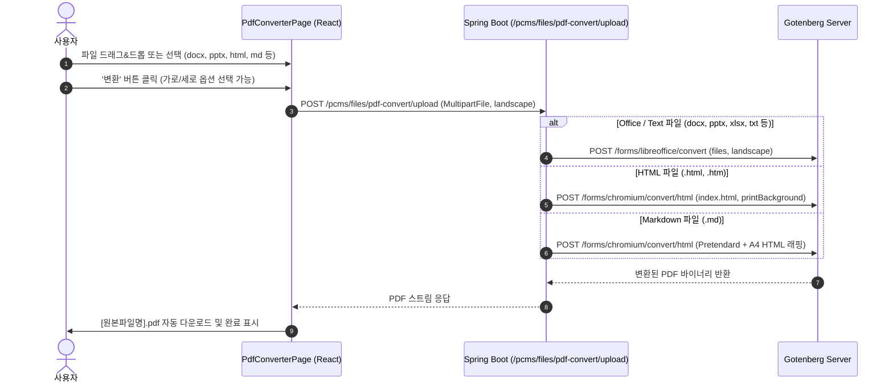

# 유틸리티 메뉴 신설 및 범용 문서 PDF 변환 기능 설계

## 1. 개요 및 목적
PCMS 상단 메뉴에 **'📖 일지'**, **'📝 게시판'**과 동일한 레벨로 **'🛠️ 유틸리티'** 대메뉴를 추가하고, 그 하위에 **'📑 PDF 변환'** 서브메뉴를 구성한다.

PDF 변환 페이지(`/utility/pdf-converter`)에서는 사용자가 다양한 형식의 문서(Office, HTML, Markdown, Text, Image 등)를 업로드하면 외부 Gotenberg 서버(LibreOffice & Chromium 엔진)를 통해 PDF로 자동 변환하여 다운로드받을 수 있다.

---

## 2. 지원 파일 형식 및 변환 엔진

| 파일 구분 | 확장자 | 변환 엔진 | Gotenberg 엔드포인트 |
|---|---|---|---|
| 워드 문서 | `.docx`, `.doc`, `.odt`, `.rtf` | LibreOffice | `/forms/libreoffice/convert` |
| 프레젠테이션 | `.pptx`, `.ppt`, `.odp` | LibreOffice | `/forms/libreoffice/convert` |
| 스프레드시트 | `.xlsx`, `.xls`, `.ods`, `.csv` | LibreOffice | `/forms/libreoffice/convert` |
| 일반 텍스트 | `.txt` | LibreOffice | `/forms/libreoffice/convert` |
| 웹 문서 | `.html`, `.htm` | Chromium | `/forms/chromium/convert/html` |
| 마크다운 | `.md`, `.markdown` | Chromium (PCMS 템플릿 래핑) | `/forms/chromium/convert/html` |
| 이미지 | `.png`, `.jpg`, `.jpeg`, `.webp` | LibreOffice / Chromium | `/forms/libreoffice/convert` |

---

## 3. 처리 흐름도

---

## 4. 구현 상세

### 4.1 백엔드
1. **`PdfService` / `PdfServiceImpl`**:
   - `convertFileToPdf(MultipartFile file, boolean landscape)` 메서드 구현
   - 파일 확장자에 따른 LibreOffice / Chromium 엔드포인트 자동 분기
2. **`FileController`**:
   - `POST /files/pdf-convert/upload` 엔드포인트 등록
   - `multipart/form-data` 수신 및 PDF 바이너리 반환

### 4.2 프론트엔드
1. **`routeConfig.ts`**:
   - `menuGroup: '🛠️ 유틸리티'`, `tabGroup: 'utility-pdf'`, `path: '/utility/pdf-converter'` 등록
2. **`PdfConverterPage.tsx`**:
   - 드래그 & 드롭 파일 업로더
   - 가로/세로(Landscape) 변환 옵션
   - 파일별 변환 상태(대기 / 진행중 / 완료 / 실패) 표시 및 개별/전체 다운로드 기능
   - '초기화', '변환' 버튼 및 `useMessage` 알림
