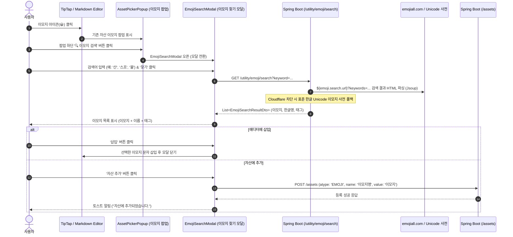

  
# 이모지 찾기 기능

## 개요

- 아래 사이트 이용
https://www.emojiall.com/ko/search_results?keywords=%EC%8A%A4%ED%94%84

- 검색 결과로 나오는 html을 해석해서 리스트

- 검색 결과가 없을 때
``` 
<div class="emoji_card_list">
                    
                    <div class="emoji_card_content">관련 검색결과가 없습니다</div>
                </div>
```
- 검색 결과가 있을 때
```html
                <div class="emoji_card_list">
                    
                    <div class="emoji_card_content"><ul><li class="row">
                                    <div class="col-auto d-flex flex-column justify-content-center">
                                        <a class="emoji_font fontsize_2x mb_half" href="/ko/emoji/%F0%9F%9B%98" style="width:54px;">🛘</a>
                                        <button type="button" class="emoji_symbol emoji_item justify-content-center d-inline-block" data-clipboard-text="🛘">복사</button>
                                    </div>
                                    <div class="col grow font_global">
                                        <p class="mb_half">
                                        <a class="text_currentColor" href="/ko/emoji/%F0%9F%9B%98"><span class="emoji_font line">🛘</span>
                                        <span class="text_orange">산사태</span></a></p>
                                        <p class="mb_half small text_silver line-clamp-2">
                                            <a class="text_currentColor" href="/ko/emoji/%F0%9F%9B%98">🛘은 가파른 산비탈에서 바위가 굴러내리고 먼지가 일어나는 모습을 묘사한 이모지로, <span class="text_orange">산사태</span>나 낙석 위험을 직관적으로 경고합니다.
핵심 의미는 폭우나 지진으로 인한 자연재해 경보와 도로 통제·우회 안내로, 한국에서는 여름 장마철에 <span class="text_orange">산사태</span> 경보가 빈번하게 발령됩니다.
확장 의미로는 '계획이 무너지다'는 비유적 표현이나 '<span class="text_orange">산사태</span> 같은 승리'처럼 압도적인 성공을 강조할 때 활용되며, 특히 스포츠 중계나 선거 결과 분석에서 이런 표현이 자주 등장합니다.
                                            </a></p>
                                        <p class="mb_0 x_small text_grey truncate">
                                            <span class="mr_2"><i class="iconfont iconheart text_orange strong"></i>12</span>
                                            <span class="mr_2"><i class="iconfont iconcomment"></i>0</span><span class="mr_2"><i class="iconfont icontag"></i><a class="text_blue mr_1" href="search_results?keywords=%EB%8F%8C">돌 </a><a class="text_blue mr_1" href="search_results?keywords=%EC%82%AC%ED%83%9C"> 사태 </a><a class="text_blue mr_1" href="search_results?keywords=%EC%82%B0"> 산 </a></span></p>
                                    </div>
                                </li><hr><li class="row">
                                    <div class="col-auto d-flex flex-column justify-content-center">
                                        <a class="emoji_font fontsize_2x mb_half" href="/ko/emoji/%F0%9F%9B%99" style="width:54px;">🛙</a>
                                        <button type="button" class="emoji_symbol emoji_item justify-content-center d-inline-block" data-clipboard-text="🛙">복사</button>
                                    </div>
                                    <div class="col grow font_global">
                                        <p class="mb_half">
                                        <a class="text_currentColor" href="/ko/emoji/%F0%9F%9B%99"><span class="emoji_font line">🛙</span>
                                        등대</a></p>
                                        <p class="mb_half small text_silver line-clamp-2">
                                            <a class="text_currentColor" href="/ko/emoji/%F0%9F%9B%99">이것은 높은 탑 모양으로 지어진 등대로, 꼭대기에서 밝은 불빛이 비춥니다. 등대는 보통 해안이나 항구 근처에 있으며, 지나가는 배들을 안내하고 위험을 경고하는 역할을 합니다.

 이 이모티콘은 등대, 해변, 관광지 등을 나타내는 데 사용할 수 있으며, 항해 및 여행 테마와 잘 어울립니다. 또한 삶의 방향, 인도, 희망을 상징하는 데에도 사용할 수 있습니다. 외로움이나 초조한 기다림을 표현할 때도 유용합니다.
                                            </a></p>
                                        <p class="mb_0 x_small text_grey truncate">
                                            <span class="mr_2"><i class="iconfont iconheart text_orange strong"></i>1</span>
                                            <span class="mr_2"><i class="iconfont iconcomment"></i>0</span><span class="mr_2"><i class="iconfont icontag"></i><a class="text_blue mr_1" href="search_results?keywords="></a></span></p>
                                    </div>
                                </li></ul></div>
                </div>
```
- 모달(이모지찾기모달)로 동작하게끔하고,  
- html editor, markdown editor에서 이모지 icon 버튼이 있음. 클릭시 자산에 있는 이모지를 보여주는 판넬이 뜨는데. 그 판넬의 하단에 'search'버튼 
- search 버튼 클릭시 '이모지찾기모달' 이 뜨도록 함.
- 이모지 찾기 모달
    - 검색어 입력, 검색어 버튼으로 상기 기술한 페이지에서 찾아서 이미지 리스트를 보여줌. 설명은 보여줄 필요 없음.
    - 삽입 버튼 클릭시 editor에 추가되도록 함.
    - 자산 추가 버튼도 있어서 자산 assets 테이블에 추가하도록 함. 
    

# 이모지 찾기 모달 및 에디터 연동 설계 및 구현 계획

## 1. 개요 및 목적

`docs/이모지찾기모달.md` 명세에 따라, **HTML 에디터(TipTap)** 및 **Markdown 에디터(MdSplitEditor)**의 이모지 선택 팝업(`AssetPickerPopup`) 하단에 **'이모지 검색'** 버튼을 추가하고, 클릭 시 외부 이모지 검색 사이트(`emoji.search.url`) 기반의 **'이모지 찾기 모달(`EmojiSearchModal`)'**을 띄워 이모지를 검색, 본문 삽입 및 자산(`assets` 테이블)에 등록할 수 있는 기능을 구현한다.

---

## 2. 전체 아키텍처 및 처리 흐름



---

## 3. 기능 상세 명세

### 3.1 검색 소스 및 설정 파일 관리
- **설정 파일 (`application.properties`)**:
  ```properties
  # Emoji search URL
  emoji.search.url=${EMOJI_SEARCH_URL:https://www.emojiall.com/ko/search_results}
  ```
- **대상 사이트**: `${emoji.search.url}?keywords={keyword}`
- **HTML 파싱 구조**:
  - 결과 컨테이너: `div.emoji_card_list`
  - 결과 아이템: `li.row`
  - 이모지 문자: `a.emoji_font` 또는 `button.emoji_symbol[data-clipboard-text]`
  - 이모지 이름/키워드: `p.mb_half a`
  - 관련 태그: `a.text_blue`
- **Fallback 전략**: 외부 사이트 차단(Cloudflare 403) 및 오프라인 상태에서도 항상 안정적으로 검색될 수 있도록 백엔드에 표준 한글 Unicode 이모지 사전 데이터셋을 내장하여 검색을 지원합니다.

### 3.2 UI / UX 요구사항
1. **에디터 팝업 하단 검색 버튼**:
   - `AssetPickerPopup`에서 `atype === 'EMOJI'`일 때 하단에 **'🔍 이모지 검색'** 버튼 표시.
   - 클릭 시 팝업을 닫고 `EmojiSearchModal`을 엽니다.
2. **이모지 찾기 모달 (`EmojiSearchModal`)**:
   - **검색 바**: 검색어 입력창 + **'찾기'** 버튼 + **'초기화'** 버튼 (GEMINI.md 버튼 규칙 준수).
   - **결과 표시**: 이모지(대형 폰트), 한글 이름, 관련 태그 뱃지 표시 (설명문 텍스트는 숨김).
   - **액션**:
     - **'삽입'**: 현재 활성 에디터의 커서 위치에 이모지 문자 삽입 후 모달 닫기.
     - **'자산 추가'**: `POST /assets` API를 호출하여 `assets` 테이블(`atype='EMOJI'`)에 저장하고 성공 메시지 표시 (기존 이모지 팝업에 즉시 반영).
     - **'복사'**: 클립보드에 이모지 복사.

---

## 4. 세부 구현 계획

### [백엔드]
1. **`application.properties`, `application-development.properties`, `application-jskn.properties`**:
   - `emoji.search.url=${EMOJI_SEARCH_URL:https://www.emojiall.com/ko/search_results}` 설정 추가
2. **`kr.co.kalpa.pcms.utility.emoji.dto.EmojiSearchResultDto`**:
   - `emoji` (String), `name` (String), `keywords` (String), `code` (String)
3. **`kr.co.kalpa.pcms.utility.emoji.service.EmojiService` & `EmojiServiceImpl`**:
   - `@Value("${emoji.search.url}") private String emojiSearchUrl;` 주입
   - `List<EmojiSearchResultDto> search(String keyword)`
   - Jsoup 크롤링 및 파싱 + 표준 한글 Unicode 사전 폴백 매핑
   - 메모리/DB 캐싱 적용
4. **`kr.co.kalpa.pcms.utility.emoji.EmojiController`**:
   - `GET /utility/emoji/search?keyword=...`
5. **`kr.co.kalpa.pcms.utility.emoji.EmojiServiceTest`**:
   - 한글 키워드("산", "스프", "사과") 검색 단위 테스트

### [프론트엔드]
1. **`frontend/src/domain/utility/types/emoji.ts`**:
   - `EmojiSearchResult` 인터페이스 정의
2. **`frontend/src/shared/components/editor/EmojiSearchModal.tsx`**:
   - 이모지 검색 다이얼로그 모달 컴포넌트 구현
3. **`frontend/src/shared/components/editor/AssetPickerPopup.tsx`**:
   - `onOpenSearchModal?: () => void` props 추가 및 하단 검색 버튼 렌더링
4. **`frontend/src/shared/components/editor/TipTapMenuBar.tsx` (HTML 에디터)**:
   - `EmojiSearchModal` 상태 관리 및 에디터 본문 삽입 연동
5. **`frontend/src/shared/components/editor/MdSplitEditor.tsx` (Markdown 에디터)**:
   - `EmojiSearchModal` 상태 관리 및 마크다운 텍스트 삽입 연동

---

## 5. 검증 계획
1. **백엔드**: `./gradlew test` (EmojiServiceTest 통과 확인)
2. **프론트엔드 Lint**: `npm run lint` (0 error, 0 warning)
3. **프론트엔드 빌드**: `npm run build` 성공
4. **통합 테스트**:
   - HTML 에디터 및 Markdown 에디터에서 '이모지 검색' 모달 실행
   - "산", "스프", "자동차" 등 검색 후 이모지 목록 확인
   - 에디터 본문 삽입 및 자산 추가 정상 동작 검증
